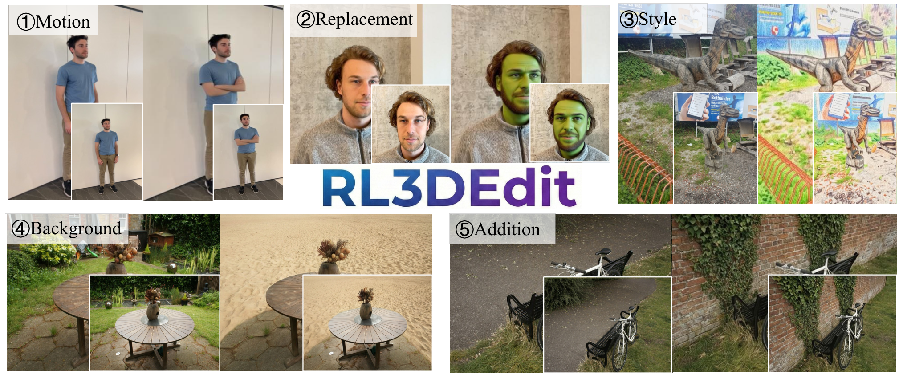

# Geometry-Guided Reinforcement Learning for Multi-view Consistent 3D Scene Editing

<p align="center">
  <a href="https://arxiv.org/abs/2603.03143"></a>
  <a href="https://amap-ml.github.io/RL3DEdit/"></a>
  <a href="#"></a>
  <a href="LICENSE"></a>
</p>


<p align="center">
  <a href="https://wangjiyuan9.github.io/">Jiyuan Wang</a><sup>1,2,3</sup> &nbsp;
  <a href="https://scholar.google.com/citations?hl=zh-CN&user=t8xkhscAAAAJ">Chunyu Lin</a><sup>1,✉</sup> &nbsp;
  <a href="#">Lei Sun</a><sup>2,✝</sup> &nbsp;
  <a href="#">Zhi Cao</a><sup>1</sup> &nbsp;
  <a href="#">Yuyang Yin</a><sup>1</sup> &nbsp;
  <a href="https://scholar.google.com/citations?hl=zh-CN&user=vo__egkAAAAJ">Lang Nie</a><sup>4</sup> &nbsp;
  <a href="#">Zhenlong Yuan</a><sup>2</sup> &nbsp;
  <a href="https://cxxgtxy.github.io/">Xiangxiang Chu</a><sup>2</sup> &nbsp;
  <a href="#">Yunchao Wei</a><sup>1</sup> &nbsp;
  <a href="https://kangliao929.github.io/">Kang Liao</a><sup>3</sup> &nbsp;
  <a href="#">Guosheng Lin</a><sup>3,✉</sup>
</p>

<p align="center">
  <sup>1</sup>BJTU &nbsp;&nbsp;
  <sup>2</sup>AMap, Alibaba Group &nbsp;&nbsp;
  <sup>3</sup>NTU &nbsp;&nbsp;
  <sup>4</sup>CQUPT &nbsp;&nbsp;
  <br>
  <sup>✉</sup>Corresponding author &nbsp;
  <sup>✝</sup>Project leader
</p>

---

<p align="center">
  
</p>

We propose **RL3DEdit**, a novel RL-based single-pass framework for 3D scene editing. Our core insight is that while *generating* multi-view consistent 3D content is highly challenging, *verifying* 3D consistency is tractable — naturally positioning reinforcement learning as a feasible solution. We leverage the 3D foundation model **VGGT** as a geometry-aware reward model and employ **GRPO** to effectively anchor the 2D editor's prior onto the 3D consistency manifold.

## 📢 News

- **[2026-03-11]**: Code and model weights are coming soon. Stay tuned! 🚀
- **[2026-03-04]**: Paper released on [arXiv](https://arxiv.org/abs/2603.03143).

## 💡 Highlights

- 🏆 **State-of-the-Art Performance**: RL3DEdit achieves a VIEScore of **5.48** (vs. 3.23 for the strongest baseline), demonstrating superior editing fidelity and semantic alignment.
- ⚡ **High Efficiency**: Single-pass inference in just **1.5 minutes** — over **2×** faster than traditional pipelines and over **20×** faster than other FLUX-based baselines.
- 🧠 **Novel RL Paradigm**: First work to introduce reinforcement learning into 3D scene editing, using VGGT as a geometry-aware reward model.

## 🛠️ Setup

> Code is coming soon. This section will be updated once the code is released.

1. **Clone the repository:**
```bash
git clone https://github.com/AMAP-ML/RL3DEdit.git
cd RL3DEdit
```

2. **Install dependencies:**
```bash
conda create -n rl3dedit python=3.10 -y
conda activate rl3dedit
pip install -r requirements.txt  # Coming soon
```

## 🔥 Training

1. **Prepare Training Data:**

    We collect 8 scenes from [IN2N](https://instruct-nerf2nerf.github.io/), [BlendedMVS](https://github.com/YoYo000/BlendedMVS), and [Mip-NeRF360](https://jonbarron.info/mipnerf360/) datasets, and construct 7–9 editing prompts per scene using a VLM, yielding 70 prompts in total.

2. **Run Training Script:**

```bash
# Training script will be released soon
accelerate launch train_grpo.py \
    --config configs/rl3dedit.yaml \
    --lora_rank 32 \
    --num_views 9 \
    --group_size 16 \
    --sde_noise 0.8
```

Training was conducted for one epoch on an NVIDIA RTX Pro 6000 GPU and took ~42 hours.

## 🕹️ Inference

### Editing a 3D Scene

```bash
# Inference script will be released soon
python inference.py \
    --scene_path /path/to/your/scene \
    --instruction "your editing instruction" \
    --output_path /path/to/output
```

### Evaluation on Test Set

```bash
# Evaluation script will be released soon
python evaluate.py --config configs/eval.yaml
```

Our test data includes 100 cases: novel views (70), unseen instructions (16), and new scenes (14).

## 🤗 Model Zoo

| Model | Backbone | Training Data | Download |
|:---|:---|:---|:---:|
| RL3DEdit | FLUX-Kontext-dev | 70 prompts, 1319 samples | Coming Soon |

## 🎓 Citation

If you find our work useful in your research, please consider citing our paper:

```bibtex
@article{wang2026geometry,
  title={Geometry-Guided Reinforcement Learning for Multi-view Consistent 3D Scene Editing},
  author={Wang, Jiyuan and Lin, Chunyu and Sun, Lei and Cao, Zhi and Yin, Yuyang and Nie, Lang and Yuan, Zhenlong and Chu, Xiangxiang and Wei, Yunchao and Liao, Kang and others},
  journal={arXiv preprint arXiv:2603.03143},
  year={2026}
}
```

## 🙏 Acknowledgements

We thank the authors of [FLUX-Kontext](https://github.com/black-forest-labs/flux), [VGGT](https://github.com/facebookresearch/vggt), [GRPO](https://arxiv.org/abs/2402.03300), and [Flow-GRPO](https://arxiv.org/abs/2505.05470) for their excellent work.

---

<p align="center">
  <em>⭐ If you find this project useful, please give it a star! ⭐</em>
</p>
