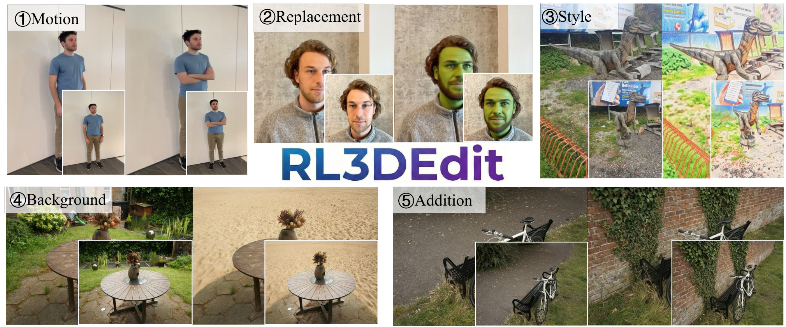

# Geometry-Guided Reinforcement Learning for Multi-view Consistent 3D Scene Editing

<p align="center">
  <a href="https://arxiv.org/abs/2603.03143"></a>
  <a href="https://amap-ml.github.io/RL3DEdit/"></a>
  <a href="https://huggingface.co/exander/RL3DEdit"></a>
  <a href="LICENSE"></a>
</p>


<p align="center">
  <a href="https://wangjiyuan9.github.io/">Jiyuan Wang</a><sup>1,2,3</sup>  
  <a href="https://scholar.google.com/citations?hl=zh-CN&user=t8xkhscAAAAJ">Chunyu Lin</a><sup>1,✉</sup>  
  <a href="#">Lei Sun</a><sup>2,✝</sup>  
  <a href="#">Zhi Cao</a><sup>1</sup>  
  <a href="#">Yuyang Yin</a><sup>1</sup>  
  <a href="https://scholar.google.com/citations?hl=zh-CN&user=vo__egkAAAAJ">Lang Nie</a><sup>4</sup>  
  <a href="#">Zhenlong Yuan</a><sup>2</sup>  
  <a href="https://cxxgtxy.github.io/">Xiangxiang Chu</a><sup>2</sup>  
  <a href="#">Yunchao Wei</a><sup>1</sup>  
  <a href="https://kangliao929.github.io/">Kang Liao</a><sup>3</sup>  
  <a href="#">Guosheng Lin</a><sup>3,✉</sup>
</p>

<p align="center">
  <sup>1</sup>BJTU   
  <sup>2</sup>AMap, Alibaba Group   
  <sup>3</sup>NTU   
  <sup>4</sup>CQUPT   
  <br>
  <sup>✉</sup>Corresponding author  
  <sup>✝</sup>Project leader
</p>

---

<p align="center">
  
</p>

We propose **RL3DEdit**, a novel RL-based single-pass framework for 3D scene editing. Our core insight is that while *generating* multi-view consistent 3D content is highly challenging, *verifying* 3D consistency is tractable — naturally positioning reinforcement learning as a feasible solution. We leverage the 3D foundation model **VGGT** as a geometry-aware reward model and employ **GRPO** to effectively anchor the 2D editor's prior onto the 3D consistency manifold.

## 📢 News

- **[2026-03-11]**: Inference code and model weights released! 🚀
- **[2026-03-04]**: Paper released on [arXiv](https://arxiv.org/abs/2603.03143).

## 🛠️ Setup

1. **Clone the repository:**

```bash
git clone https://github.com/AMAP-ML/RL3DEdit.git
cd RL3DEdit
```

2. **Install dependencies:**

```bash
conda create -n rl3dedit python=3.10 -y
conda activate rl3dedit
pip install -r requirements.txt
```

3. **Model weights** are downloaded automatically from 🤗 [`exander/RL3DEdit`](https://huggingface.co/exander/RL3DEdit) on first run. The VAE and text encoders are pulled from the base [`black-forest-labs/FLUX.1-Kontext-dev`](https://huggingface.co/black-forest-labs/FLUX.1-Kontext-dev) repo — make sure you have accepted its license on Hugging Face and are logged in (`huggingface-cli login`).

## 🕹️ Inference

RL3DEdit edits a **3×3 grid** that tiles 9 views of the same scene (row-major). You can pass either a pre-tiled grid image or a directory of 9 view images.

### Quick start

```bash
# from a pre-tiled 3x3 grid image
python inference.py \
    --input examples/example_grid_bear.jpg \
    --instruction "remove the stone base beneath the bear statue" \
    --enhance \
    --output output.jpg
```

```bash
# from a directory of exactly 9 views (sorted by filename)
python inference.py \
    --views_dir path/to/9views/ \
    --instruction "replace the bear statue with a stone lion" \
    --output output.jpg \
    --save_views output_views/
```

Key options:

| Flag | Description |
| :--- | :--- |
| `--input` / `--views_dir` | a pre-tiled 3×3 grid, **or** a folder of 9 views (mutually exclusive) |
| `--instruction` | your editing instruction (English or Chinese) |
| `--enhance` | rewrite the instruction into 3×3 / 3D-consistent phrasing |
| `--save_views DIR` | also save the 9 edited views separately |
| `--no_cpu_offload` | disable CPU offload (faster, needs more VRAM) |
| `--dit_path` / `--base_repo` | use local weights instead of downloading |

### Instruction enhancement (`--enhance`)

A short instruction works best when rewritten to match the training distribution
(*"… in the 3×3 grid, … 3D-consistent across all nine views …"*). With `--enhance`:

- If an **OpenAI-compatible** API is configured, the instruction is rewritten by an LLM:
  ```bash
  export OPENAI_API_KEY=sk-...
  export OPENAI_BASE_URL=https://your-endpoint/v1   # optional, for compatible APIs
  export RL3DEDIT_ENHANCE_MODEL=gpt-4o-mini          # optional
  ```
- Otherwise it falls back to a deterministic template (no API needed).

### Programmatic use

```python
from rl3dedit import RL3DEditPipeline, enhance_instruction
from PIL import Image

pipe = RL3DEditPipeline.from_pretrained()            # downloads weights on first run
instr = enhance_instruction("remove the stone base beneath the bear statue")
grid = pipe.edit(Image.open("examples/example_grid_bear.jpg"), instr)
grid.save("output.jpg")
```

## 🤗 Model Zoo

| Model    | Backbone         | Training Data            |  Download  |
| :------- | :--------------- | :----------------------- | :---------: |
| RL3DEdit | FLUX-Kontext-dev | 70 prompts, 1319 samples | [🤗 exander/RL3DEdit](https://huggingface.co/exander/RL3DEdit) |

## 🎓 Citation

If you find our work useful in your research, please consider citing our paper:

```bibtex
@article{wang2026geometry,
  title={Geometry-Guided Reinforcement Learning for Multi-view Consistent 3D Scene Editing},
  author={Wang, Jiyuan and Lin, Chunyu and Sun, Lei and Cao, Zhi and Yin, Yuyang and Nie, Lang and Yuan, Zhenlong and Chu, Xiangxiang and Wei, Yunchao and Liao, Kang and others},
  journal={arXiv preprint arXiv:2603.03143},
  year={2026}
}
```

## 🙏 Acknowledgements

We thank the authors of [FLUX-Kontext](https://github.com/black-forest-labs/flux), [VGGT](https://github.com/facebookresearch/vggt), [Flow-Factory](https://github.com/X-GenGroup/Flow-Factory), [GRPO](https://arxiv.org/abs/2402.03300), and [Flow-GRPO](https://arxiv.org/abs/2505.05470) for their excellent work.

---

<p align="center">
  <em>⭐ If you find this project useful, please give it a star! ⭐</em>
</p>
